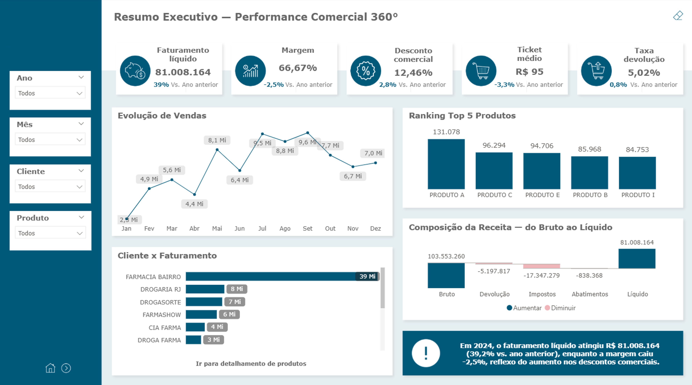
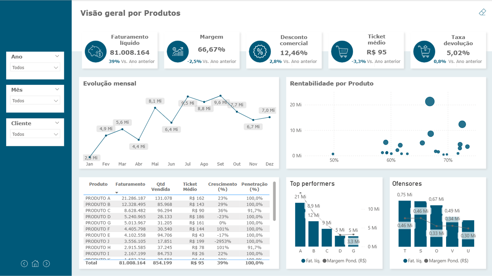
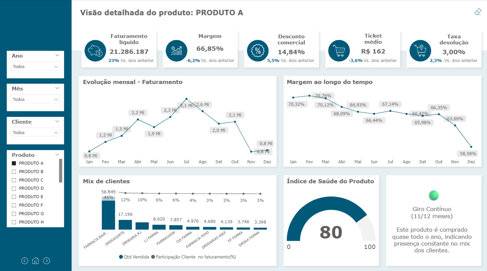
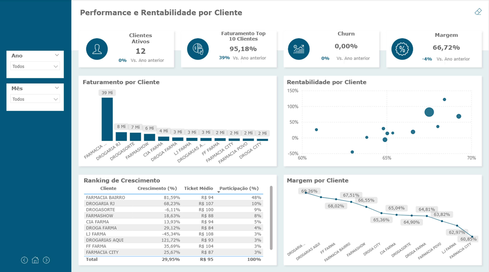
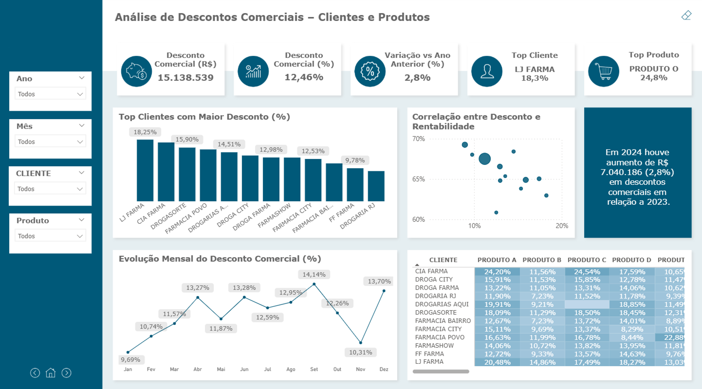
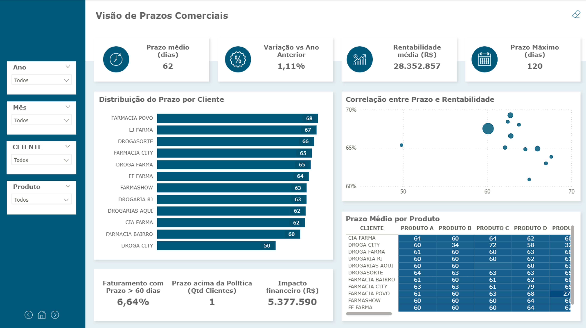
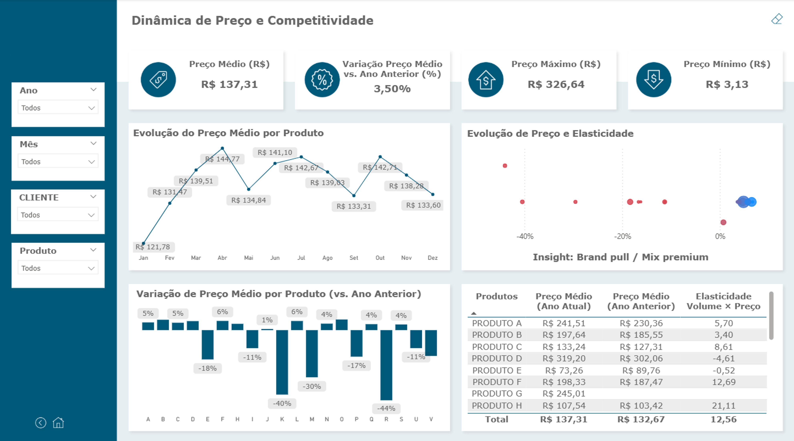
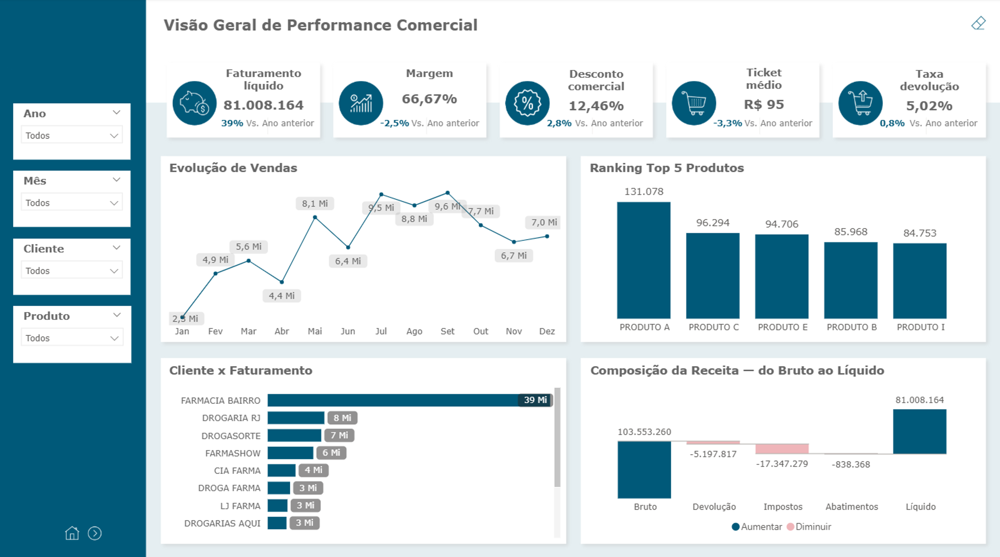

# Performance Comercial 360

Selection case built for a pharmaceutical company recruitment process, simulating B2B sell-in analytics between distributors and pharmacies.

> All data is fictional or anonymized. Client and product names have been replaced with generic identifiers.

---

## Objective

Build a complete commercial performance analytics solution covering revenue, margin, discounts, payment terms, and pricing — focused on actionable insights for the sales force.

---

## Dashboard Pages

| Page | Description |
|---|---|
| Executive Summary | Core KPIs: net revenue, margin, commercial discount, average ticket, return rate |
| Product Overview | Profitability, monthly trend, top/bottom performers |
| Product Detail | Drill-down by product: client mix, product health index, margin over time |
| Client Performance | Revenue, churn, profitability and growth ranking |
| Discount Analysis | Discount x profitability correlation, monthly trend, client x product matrix |
| Payment Terms | Average term by client/product, financial impact, clients outside policy |
| Price Dynamics | Volume x price elasticity, YoY variance, average price by product |

---

## Advanced DAX Patterns

| Measure | Pattern |
|---|---|
| `Volume x Price Elasticity` | 6-scenario dynamic classification via `SWITCH(TRUE())` with configurable tolerance |
| `Waterfall Value` | Disconnected `DATATABLE` + `SELECTEDVALUE` + `SWITCH` |
| `Top Client (Highest Discount)` | Dynamic ranking via `ADDCOLUMNS` + `SUMMARIZE` + `TOPN` + `MAXX` |
| `Executive Summary Text` | Narrative analytics — executive insight auto-generated via DAX string concatenation |
| `Discount Page Title` | Context-responsive UI via `ISFILTERED` + `SELECTEDVALUE` |
| `Top 10 Clients Revenue Variance` | `TOPN` inside `SUMX` with fixed year for independent period ranking |
| `Variance Color` | Conditional formatting via DAX returning hex color string |

---

## Key Technical Highlights

- Gross to Net Revenue Waterfall (Returns, Taxes, Allowances)
- Discount x Profitability and Payment Term x Profitability scatter charts by client
- Product Health Index with dynamic gauge based on continuous sales cycle
- Volume x Price Elasticity calculated entirely in DAX
- Custom page navigation with consistent visual identity

---

## Stack

| Layer | Technology |
|---|---|
| BI Tool | Power BI Desktop |
| Language | DAX |
| Data | Simulated / Anonymized |

---

## Screenshots

